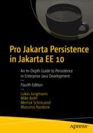

# Add a maven build system  *Pro Jakarta Persistence in Jakarta EE 10*

The repo this forks uses ANT patterns such as building multiple applications from the same directory.
Those other applications are typically test harnesses, and it is not easily maintainable or tractable as organized.
Ideally those would each be separate maven modules. Since APress book GitHub repos seldom get updated I will go ahead
and create separate modules since its unlikely that this fork will get upstreamed.
This will be a slow linear process, added as I go through the book. I will start at chapter 2, and march forward.
Eventually , a parent pom will emerge but not at first.

## Maven vs Gradle
While I have used both, maven by its very design is a constrained, somewhat inflexible build system out of the box.
However, that inflexibility by its very nature makes debugging problems straight forward and predictable, 
and hence its choice. In addition, while IDE's can run/build Gradle projects using gradle, the use of maven allows your
IDE to convert a project it into its internal build system, which is an advantage.

# Apress Source Code

This repository accompanies [*Pro Jakarta Persistence in Jakarta EE 10*](https://link.springer.com/book/10.1007/978-1-4842-7443-9) by  Lukas Jungmann, Mike Keith, Merrick Schincariol, and Massimo Nardone (Apress, 2022).

Download the files as a zip using the green button, or clone the repository to your machine using Git.

## Releases

Release v1.0 corresponds to the code in the published book, without corrections or updates.

## Contributions

See the file Contributing.md for more information on how you can contribute to this repository.